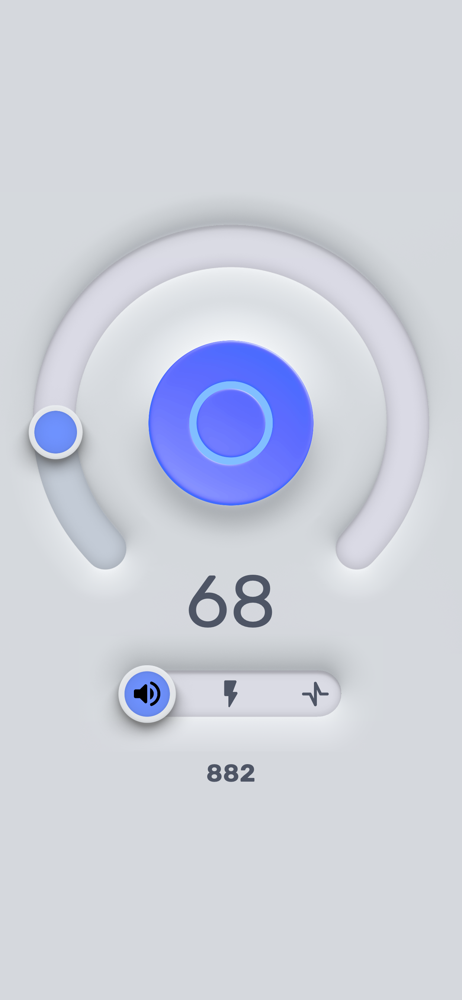
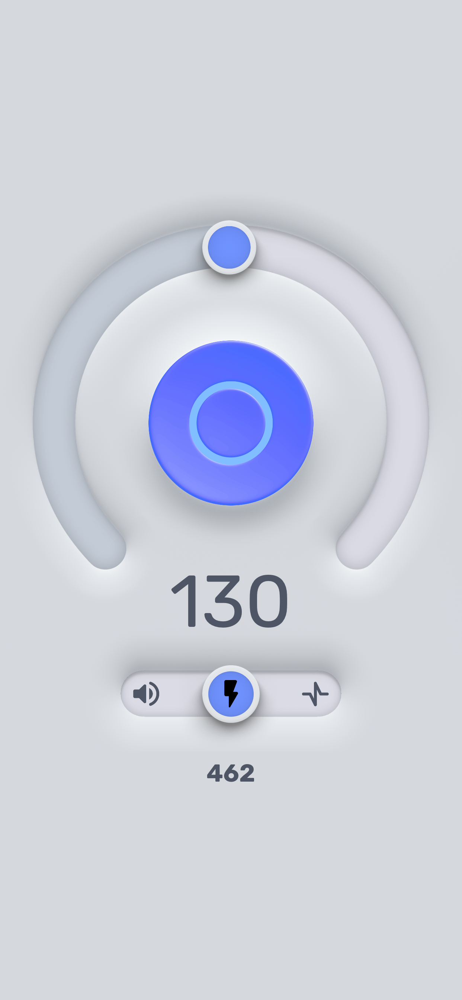
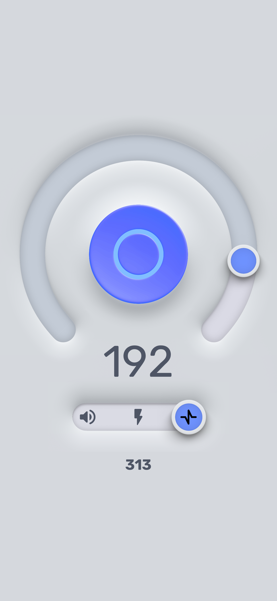

# iOS Metronome App

Modernized iOS metronome application built with modular architecture, reusable UI components, and responsive layouts for iPhone and iPad.

[Figma Prototype](https://www.figma.com/design/vw6yaP2oIvpPNoT3QTRETy/Layout?node-id=356-186&t=LjbdhCSG2DGroDXo-1)

## Screenshots

| Splash | Sound | Flash | Pulse |
|:---:|:---:|:---:|:---:|
|  |  |  |  |

## Features

- Modular architecture with clean separation of concerns
- Low latency audio playback (pre-warmed player pool with uncompressed PCM)
- Camera flash synchronization (`AVCaptureDevice` torch)
- Precision haptic feedback (`UIImpactFeedbackGenerator`)
- Responsive Auto Layout storyboards for iPhone and iPad
- Reusable custom views (`TopSliderBar`, `BottomSliderBar`)
- Custom typography system (`Rubik` fonts)
- Figma-to-iOS Auto Layout workflow
- App Store in-app review prompting (`SKStoreReviewController`)
- Google Mobile Ads SDK integration (Banner Ads)

## Tech Stack

| Category | Technologies |
|---|---|
| **Language** | Swift |
| **Platform** | iOS SDK (Universal: iPhone & iPad) |
| **Architecture** | MVC / Modular Engine |
| **UI** | UIKit, Auto Layout, Storyboards, Custom Views, SwiftUI |
| **Audio & Hardware** | AVFoundation, AudioToolbox, CoreHaptics |
| **Monetization** | Google Mobile Ads SDK |

## Architecture

The application follows a modular architecture with clear separation between UI, business logic, hardware interaction, and audio engines.

```
┌─────────────────────────────────┐
│           UI Layer              │  Storyboards (iPhone/iPad) + Custom Views
├─────────────────────────────────┤
│          Controllers            │  ViewController (State + User Interaction)
├─────────────────────────────────┤
│            Engines              │  MetronomeEngine (Tick Synchronization)
├─────────────────────────────────┤
│     Hardware Controllers        │  SoundEngine, FlashController, HapticsEngine
└─────────────────────────────────┘
```


## Contact

**Oleksandr C.**

[LinkedIn](https://www.linkedin.com/in/ochashchin/)
